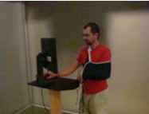
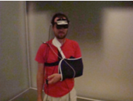
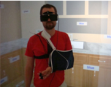
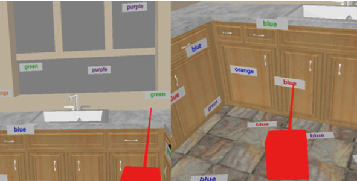
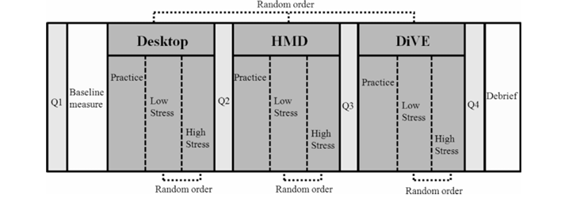
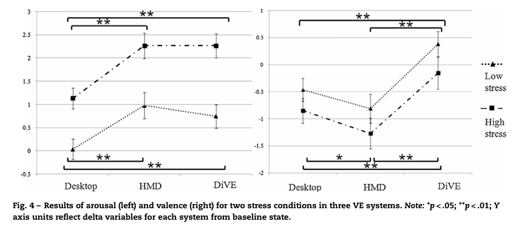
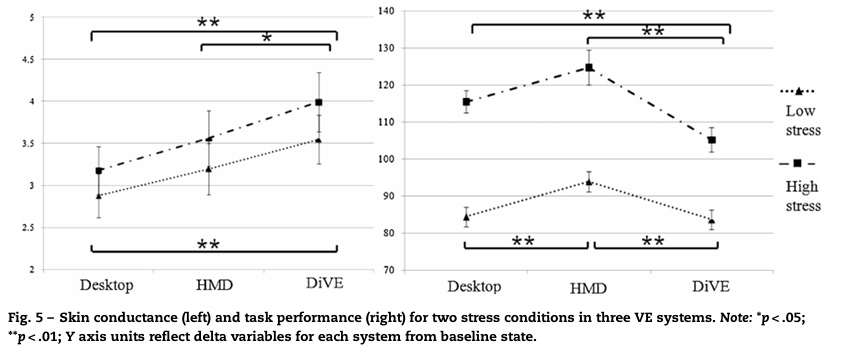
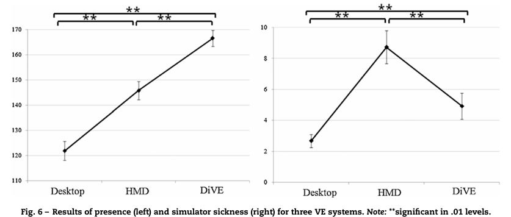

## 논문 정보

**제목**  
Effects of Virtual Environment Platforms on Emotional Responses

**저자**  
Kim et al.

**학회/저널**  
Computer Methods and Programs in Biomedicine

**발행연도**  
2014

**DOI**  
(추가 예정)

---

## 한 줄 요약

> **동일한 VR 콘텐츠라도 플랫폼에 따라 감정 반응, 몰입감(Presence), 수행 능력이 달라질 수 있으며, 연구 목적에 맞는 플랫폼 선택이 중요하다.**

---

## 연구 배경 (Background)

Virtual Environment(VE)는 교육, 훈련, 게임뿐 아니라 심리학과 정신의학 분야에서도 널리 활용되고 있다.

VE는 현실과 유사한 환경을 제공하면서도 실험 조건을 통제할 수 있다는 장점이 있다.

기존 연구에서는 Desktop과 HMD, 또는 Desktop과 CAVE를 비교한 연구는 있었지만, 세 가지 플랫폼을 동일한 조건에서 직접 비교한 연구는 거의 없었다.

---

## 연구 목적 (Objective)

본 연구의 목적은 Desktop, HMD, DiVE(CAVE)가 사용자의 감정 반응과 행동 수행에 미치는 영향을 비교하는 것이다.

연구에서는 다음과 같은 질문에 답하고자 했다.

- 플랫폼에 따라 Emotional Reactivity가 달라지는가?
- 플랫폼에 따라 Task Performance가 달라지는가?
- Presence는 어느 플랫폼이 가장 높은가?
- Simulator Sickness는 어느 플랫폼이 가장 심한가?

---

## 실험 방법 (Method)

### Participants

- Duke University 학생 53명
- 평균 연령 21.6세
- 불안 수준이 높은 참가자는 제외

### Experimental Design

- 3 × 2 Within-Subject Design

**Platform**

- Desktop
- HMD
- DiVE(CAVE)

**Stress**

- Low Stress
- High Stress

각 플랫폼에서 참가자가 실험에 참여하는 모습:

  <figure class="image-figure">
    
    <figcaption>Desktop 환경</figcaption>
  </figure>
  <figure class="image-figure">
    
    <figcaption>HMD 환경</figcaption>
  </figure>
  <figure class="image-figure">
    
    <figcaption>CAVE(DiVE) 환경</figcaption>
  </figure>

### Variables

**독립변수 (IV)**

- VE Platform
- Stress Level

**종속변수 (DV)**

- Emotional Arousal
- Emotional Valence
- Skin Conductance Response
- Task Performance
- Presence
- Simulator Sickness

### Task

Modified 3D Stroop Task를 수행하였다.

참가자는 GREEN과 BLUE 카드를 가능한 빠르고 정확하게 선택해야 하며, High Stress 조건에서는 큰 소리, 화면 깜빡임, 발목 진동을 추가하여 스트레스를 유발하였다.

### Procedure

1. 사전 설문 및 BAI 측정
2. Baseline 측정
3. 플랫폼별 연습
4. Low Stress / High Stress 수행
5. 설문 평가
6. Debriefing

---

## 결과 (Results)

### 1. Emotional Arousal & Valence

**Emotional Arousal**

→ Desktop보다 HMD와 DiVE에서 더 높은 Emotional Arousal이 나타났다.

High Stress에서는 모든 플랫폼에서 Emotional Arousal이 증가하였다.

**Emotional Valence**

→ DiVE는 비교적 긍정적인 감정을 유지한 반면 HMD는 가장 부정적인 감정을 유발하였다.

---

### 2. Skin Conductance Response & Task Performance

**Skin Conductance Response**

→ Desktop → HMD → DiVE 순으로 SCR이 증가하였다.

몰입 수준이 높을수록 생리적 각성도 증가하는 경향을 보였다.

**Task Performance**

→ High Stress 환경에서는 DiVE가 가장 빠른 수행 시간을 보였다.

정확도는 플랫폼 간 차이가 거의 없었다.

---

### 3. Presence & Simulator Sickness

**Presence**

→ DiVE > HMD > Desktop 순으로 높았다.

**Simulator Sickness**

→ HMD가 가장 높은 멀미를 유발하였다.

---

## Discussion

저자는 플랫폼마다 장단점이 존재하며 가장 좋은 플랫폼은 존재하지 않는다고 설명한다.

- 높은 Presence가 필요한 연구 → DiVE
- 부정적인 감정을 유도하는 연구 → HMD
- 멀미를 최소화해야 하는 연구 → Desktop

즉, 연구 목적에 맞게 플랫폼을 선택하는 것이 중요하다는 것이 핵심이다.

---

## Limitations

- 대학생만을 대상으로 실험하였다.
- Desktop, HMD, DiVE 세 가지 플랫폼만 비교하였다.
- HMD의 부정적인 감정이 장비 자체 때문인지 착용감 때문인지는 확인하지 못하였다.
- 최신 VR HMD에 대한 검증이 필요하다.

---

## 내가 느낀 점

이번 논문에서 가장 흥미로웠던 점은 같은 가상환경이라도 사용하는 플랫폼에 따라 감정 반응과 수행 능력이 달라질 수 있다는 점이었다.

그동안 VR 콘텐츠를 개발하면서는 콘텐츠의 재미, 인터랙션, UI/UX에 집중했기 때문에 플랫폼은 단순히 콘텐츠를 실행하는 장치 정도로 생각했다. 하지만 이번 논문를 통해 플랫폼 선택 자체도 사용자 경험과 실험 결과에 영향을 줄 수 있는 중요한 요소라는 점을 알게 되었다.

또한 연구에서 사용된 HMD는 비교적 오래된 장비였기 때문에 최신 VR 기기에서는 다른 결과가 나타날 가능성도 있다고 생각한다. 그러나 단순히 기기의 성능이 향상되었다고 해서 모든 문제가 해결되는 것은 아닐 것이다. 플랫폼에 따라 몰입감, 감정 반응, 멀미, 과제 수행 능력 등이 달라질 수 있으므로 콘텐츠를 개발할 때도 플랫폼의 특성을 함께 고려하는 것이 중요하다고 느꼈다.

앞으로 VR/XR 콘텐츠를 개발할 때는 콘텐츠의 완성도뿐만 아니라 어떤 플랫폼에서 가장 적합한 사용자 경험을 제공할 수 있는지도 함께 고민해야겠다고 생각했다. 또한 향후 XR 관련 콘텐츠를 개발하거나 사용자 연구를 진행할 때에도 플랫폼 선택을 중요한 변수 중 하나로 고려해야겠다는 점을 배울 수 있었다.
